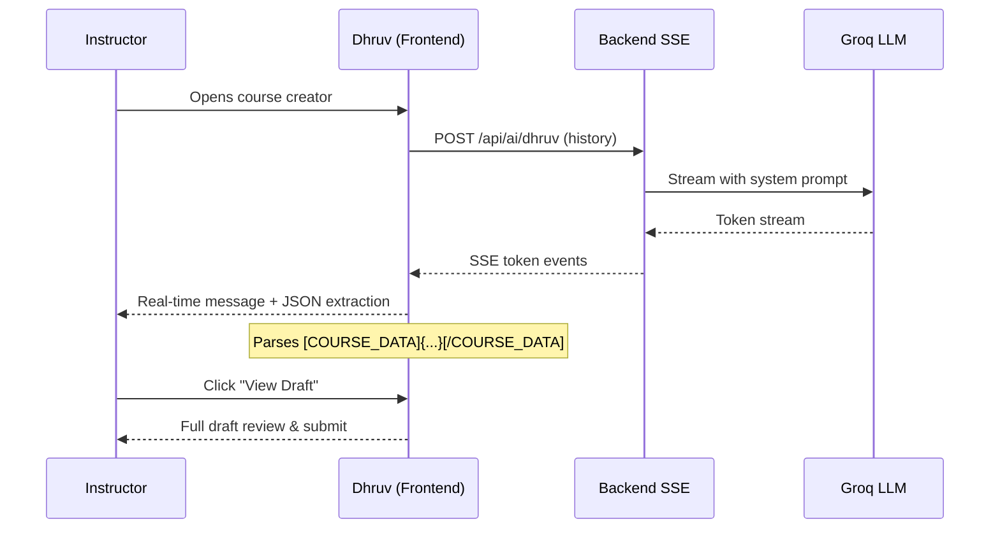
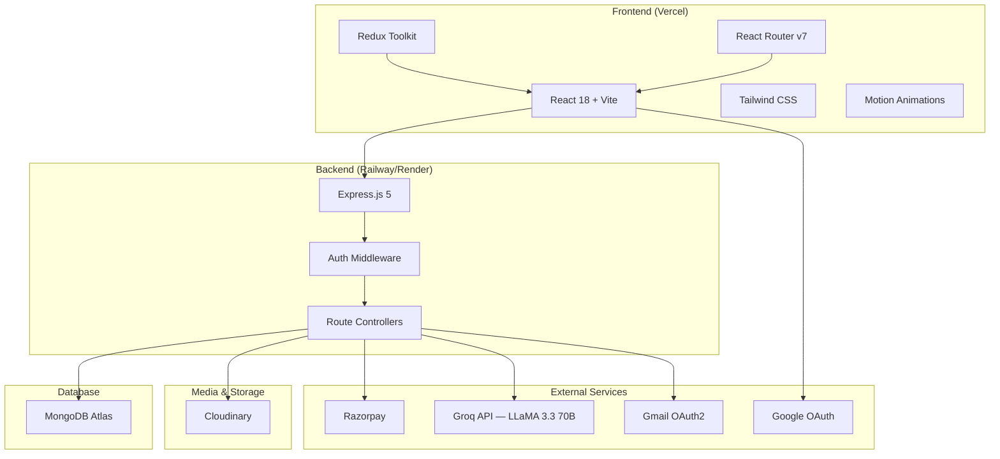
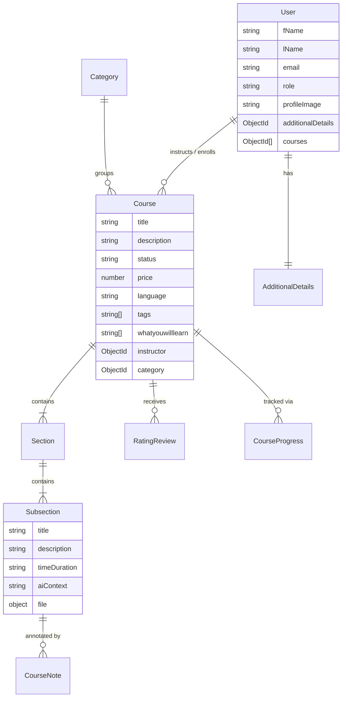
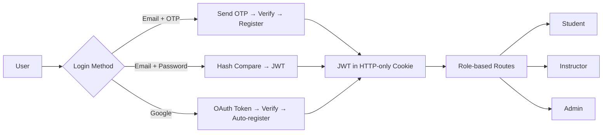

<div align="center">


<h3>🚀 Your AI-Powered E-Learning Platform — Learn Without Limits</h3>

[](https://reactjs.org/)
[](https://nodejs.org/)
[](https://www.mongodb.com/)
[](https://vitejs.dev/)

[](https://opensource.org/licenses/MIT)
[](http://makeapullrequest.com)
[](https://udaan-tawny.vercel.app)

<h4>
  <a href="#-quick-start">Quick Start</a> ·
  <a href="#-features">Features</a> ·
  <a href="#-dhruv-ai-agent">Dhruv AI</a> ·
  <a href="#-architecture">Architecture</a> ·
  <a href="#-api-reference">API Docs</a>
</h4>

</div>

---

## 📊 Project Status

<div align="center">

| Metric | Status |
|--------|--------|
| 🏗️ **Build** |  |
| 📦 **Version** |  |
| 🌐 **Deployment** |  |
| 💳 **Payments** |  |
| 🤖 **AI Model** |  |

</div>

---

## 🎯 What is Udaan?

**Udaan** (उड़ान — *meaning "flight" in Hindi*) is a full-stack, AI-enhanced e-learning platform that empowers instructors to create rich, structured courses and students to discover, purchase, and consume educational content — all in one seamless ecosystem.

> *"Every learner deserves a launchpad. Udaan is that launchpad."*

### The Problem
- Instructors waste hours manually structuring course content
- Learners struggle to find quality, relevant courses in their budget
- Existing platforms lack contextual AI assistance during learning

### Our Solution
Udaan combines a robust LMS backbone with **Dhruv** — a conversational AI agent that guides instructors through course creation — and a Groq-powered in-lesson AI assistant that answers questions with full course context.

---

## ✨ Features

<table>
<tr>
<td width="33%" valign="top">

### 🤖 Dhruv — AI Course Creator


- 7-phase conversational course builder
- Streaming SSE real-time responses
- Auto-extracts structured JSON data
- Phase-aware quick-reply chips
- Live draft preview sidebar

</td>
<td width="33%" valign="top">

### 🎓 Course Management


- Course → Section → Subsection hierarchy
- Draft / Reviewing / Published workflow
- Cloudinary video & image hosting
- Rating & review system
- AI-powered course recommendations

</td>
<td width="33%" valign="top">

### 💳 Payments & Enrollment


- Razorpay order creation & verification
- Signature-verified secure checkout
- Instant enrollment on payment
- Transactional confirmation emails
- Shopping cart with localStorage sync

</td>
</tr>

<tr>
<td width="33%" valign="top">

### 🔐 Auth & Security


- OTP email verification (5-min TTL)
- Google OAuth one-click login
- HTTP-only cookie JWT storage
- bcrypt password hashing
- Role-based access control

</td>
<td width="33%" valign="top">

### 📝 In-Lesson AI Assistant


- Ask questions about lesson content
- AI context stored per subsection
- Personal timestamped notes
- Notes indexed by user + subsection
- Persistent across sessions

</td>
<td width="33%" valign="top">

### 📈 Progress Tracking


- Mark videos as complete
- Resume from last position
- Course-level completion stats
- Instructor analytics dashboard
- Enrolled student insights

</td>
</tr>
</table>

---

## 🤖 Dhruv — AI Course Creation Agent

Dhruv is the crown jewel of Udaan — a **7-phase agentic AI** that holds a natural conversation with instructors and extracts all the data needed to build a complete course.

```
Phase 1 → Warm welcome & course goal
Phase 2 → Core info: title, description, language, difficulty, audience
Phase 3 → Learning outcomes (3–5 concrete skills)
Phase 4 → Course structure & modules
Phase 5 → Pricing & prerequisites
Phase 6 → Category & discovery tags
Phase 7 → Confirmation & draft handoff
```

### How It Works



**Key technical features:**
- **Streaming SSE** — tokens arrive in real time, zero wait
- **JSON embedding** — every response includes `[COURSE_DATA]{...}[/COURSE_DATA]` parsed client-side
- **Stale-closure prevention** — `messagesRef` pattern ensures history is always current
- **React 18 StrictMode safe** — guarded `hasGreeted` ref prevents double greeting

---

## 🏗️ Architecture



---

## 🛠️ Tech Stack

### Frontend

| Technology | Version | Purpose |
|------------|---------|---------|
|  React | 18.3.1 | UI framework |
|  Vite | 7.1.2 | Build tool & dev server |
|  Redux Toolkit | 2.8.2 | Global state management |
|  React Router | 7.8.1 | Client-side routing |
|  Tailwind CSS | 3.4.17 | Utility-first styling |
|  Motion | 12.23.12 | Animations & transitions |
|  Axios | 1.11.0 | HTTP client |
|  @react-oauth/google | 0.13.5 | Google sign-in |

### Backend

| Technology | Version | Purpose |
|------------|---------|---------|
|  Node.js | LTS | JavaScript runtime |
|  Express.js | 5.1.0 | Web framework |
|  Mongoose | 8.17.1 | MongoDB ODM |
|  jsonwebtoken | 9.0.2 | Authentication tokens |
|  bcrypt | 6.0.0 | Password hashing |
|  Cloudinary | 2.7.0 | Media storage |
|  Razorpay | 2.9.6 | Payment gateway |
|  Nodemailer + Gmail API | 7.0.5 | Transactional email |

### AI & Intelligence

<p>


</p>

---

## 📂 Project Structure

```
Udaan/
├── 📁 backend/                     # Express.js API server
│   ├── 📁 config/
│   │   ├── db.js                   # MongoDB Atlas connection
│   │   ├── cloudinary.js           # Cloudinary SDK setup
│   │   └── razorpay.js             # Razorpay instance
│   ├── 📁 controllers/
│   │   ├── authController.js       # Register, login, OTP, OAuth
│   │   ├── courseController.js     # Course CRUD + recommendations
│   │   ├── sectionController.js    # Section management
│   │   ├── subsectionController.js # Subsection + video upload
│   │   ├── aiController.js         # In-lesson AI + notes
│   │   ├── dhruvController.js      # Dhruv streaming SSE agent ⭐
│   │   ├── payment.js              # Razorpay order + verify
│   │   ├── profileController.js    # User profile
│   │   └── ratingAndReviewController.js
│   ├── 📁 middlewares/
│   │   ├── auth.js                 # JWT verification
│   │   └── roleCheck.js            # isStudent, isInstructor, isAdmin
│   ├── 📁 models/                  # Mongoose schemas
│   │   ├── userModel.js
│   │   ├── courseModel.js
│   │   ├── sectionModel.js
│   │   ├── subsectionModel.js
│   │   ├── courseProgressModel.js
│   │   ├── courseNoteModel.js
│   │   ├── categoryModel.js
│   │   ├── ratingAndReviewModel.js
│   │   └── otpModel.js             # TTL 5-min expiry
│   ├── 📁 routes/
│   │   ├── userRoutes.js
│   │   ├── courseRoutes.js
│   │   ├── aiRoutes.js             # /ask, /dhruv, /notes
│   │   ├── paymentsRoutes.js
│   │   └── ...
│   ├── 📁 templates/               # HTML email templates
│   └── server.js                   # Entry point
│
├── 📁 frontend/                    # React + Vite SPA
│   └── 📁 src/
│       ├── 📁 components/
│       │   ├── 📁 Auth/            # Login, Signup, OTP, ProtectedRoute
│       │   ├── 📁 Dasboard/
│       │   │   ├── 📁 AddCourse/   # Dhruv AI chat + draft review ⭐
│       │   │   ├── Cart/
│       │   │   ├── MyCourses.jsx
│       │   │   └── InstructorDashboard.jsx
│       │   └── 📁 ViewCourse/
│       │       ├── AiSidebar.jsx   # In-lesson AI chat
│       │       └── PersonalNotes.jsx
│       ├── 📁 pages/               # Route-level page components
│       ├── 📁 services/            # API calls & operations
│       ├── 📁 slices/              # Redux state slices
│       ├── App.jsx                 # Router configuration
│       └── store.js                # Redux store
│
└── package.json                    # Monorepo root scripts
```

---

## 🗄️ Database Schema



---

## 🚀 Quick Start

### Prerequisites

<p>


</p>

### Installation

```bash
# 1. Clone the repository
git clone https://github.com/Harsh3004/Udaan.git
cd Udaan

# 2. Install root dependencies
npm install

# 3. Install backend dependencies
cd backend && npm install && cd ..

# 4. Install frontend dependencies
cd frontend && npm install && cd ..
```

### Environment Setup

**`backend/.env`**
```env
PORT=5000
DB_URL=mongodb+srv://<user>:<pass>@cluster.mongodb.net/udaan

CLIENT_URL_DEV=http://localhost:5173
CLIENT_URL_PROD=https://your-production-url.vercel.app

SECRET_KEY=your_jwt_secret_key

# Cloudinary
CLOUDINARY_CLOUD_NAME=your_cloud_name
CLOUDINARY_API_KEY=your_api_key
CLOUDINARY_API_SECRET=your_api_secret
FOLDER_NAME=Udaan

# Razorpay
RAZORPAY_KEY=rzp_test_xxxxxxxxxxxx
RAZORPAY_SECRET=your_razorpay_secret

# Gmail OAuth2
MAIL_HOST=smtp.gmail.com
MAIL_USER=your@gmail.com
GMAIL_CLIENT_ID=your_client_id
GMAIL_CLIENT_SECRET=your_client_secret
GMAIL_REFRESH_TOKEN=your_refresh_token

# AI
GROQ_API_KEY=gsk_xxxxxxxxxxxxxxxxxxxx
```

**`frontend/.env`**
```env
VITE_BASE_URL=http://localhost:5000/api
VITE_RAZORPAY_KEY=rzp_test_xxxxxxxxxxxx
VITE_GOOGLE_CLIENT_ID=your_google_client_id.apps.googleusercontent.com
```

### Running Locally

```bash
# Terminal 1 — Backend API
cd backend
npm run dev
# → http://localhost:5000

# Terminal 2 — Frontend Dev Server
cd frontend
npm run dev
# → http://localhost:5173
```

### Available Scripts

| Location | Command | Description |
|----------|---------|-------------|
| `/backend` | `npm run dev` | 🔄 Nodemon dev server |
| `/backend` | `npm start` | ▶️ Production server |
| `/frontend` | `npm run dev` | 🚀 Vite HMR dev server |
| `/frontend` | `npm run build` | 📦 Production build |
| `/frontend` | `npm run preview` | 👀 Preview production build |

---

## 🌐 API Reference

**Base URL:** `http://localhost:5000/api` (dev) | `https://your-backend-url/api` (prod)

### Authentication `/api/auth`

| Method | Endpoint | Description | Auth Required |
|--------|----------|-------------|:---:|
| `POST` | `/sendOtp` | Send OTP to email | ❌ |
| `POST` | `/signUp` | Register new user | ❌ |
| `POST` | `/login` | Email & password login | ❌ |
| `POST` | `/google-auth` | Google OAuth login | ❌ |
| `GET` | `/logout` | Clear session | ❌ |
| `PUT` | `/changePassword` | Change password | ✅ |
| `PUT` | `/forgotPassword` | Send reset link | ❌ |
| `PUT` | `/update-password` | Reset via token | ❌ |

### Courses `/api/course`

| Method | Endpoint | Description | Role |
|--------|----------|-------------|------|
| `GET` | `/` | All published courses | Public |
| `GET` | `/:courseId` | Course details | Public |
| `POST` | `/create` | Create a course | Instructor |
| `PUT` | `/update/:courseId` | Update course | Instructor |
| `DELETE` | `/delete/:courseId` | Delete course | Instructor |
| `GET` | `/getInstructorCourses` | My courses | Instructor |
| `GET` | `/getEnrolledCourses` | Enrolled courses | Student |
| `GET` | `/recommended/:courseId` | AI recommendations | Public |
| `POST` | `/update-course-progress` | Mark video complete | Student |

### AI `/api/ai`

| Method | Endpoint | Description | Auth |
|--------|----------|-------------|:---:|
| `POST` | `/ask` | Ask in-lesson question | ✅ |
| `POST` | `/dhruv` | **Dhruv SSE stream** | ✅ |
| `POST` | `/notes` | Save timestamped note | ✅ |
| `GET` | `/notes/:subsectionId` | Get notes | ✅ |
| `DELETE` | `/notes/:noteId` | Delete note | ✅ |

<details>
<summary><b>📡 Dhruv SSE Endpoint Details</b></summary>

```
POST /api/ai/dhruv
Content-Type: application/json
Authorization: Bearer <token>

Body:
{
  "messages": [
    { "role": "user", "content": "..." },
    { "role": "assistant", "content": "..." }
  ]
}

Response: text/event-stream
data: {"token": "Hello"}
data: {"token": " there"}
data: [DONE]
```
Every Dhruv response embeds structured data:
```
[COURSE_DATA]{"title":"...","phase":3,...}[/COURSE_DATA]
```
</details>

### Payments `/api/payment`

| Method | Endpoint | Description | Auth |
|--------|----------|-------------|:---:|
| `POST` | `/create-order` | Create Razorpay order | Student |
| `POST` | `/verify` | Verify payment signature | Student |

---

## 🔐 Authentication Flow



---

## 🎓 User Roles

| Role | Capabilities |
|------|-------------|
| **Student** | Browse, purchase, watch courses, track progress, ask AI, write notes & reviews |
| **Instructor** | Create courses with Dhruv AI, manage sections/videos, view analytics, publish |
| **Admin** | Manage categories, approve course listings, platform oversight |

---

## 📧 Email System

Automated HTML emails are sent for every key event:

| Trigger | Template |
|---------|----------|
| Registration | Welcome email with onboarding tips |
| OTP Verification | 6-digit code (5-min expiry) |
| Password Reset | Secure reset link (UUID token) |
| Course Purchase | Enrollment confirmation |
| Course Published | Notification to instructor |
| Course Deleted | Notification to enrolled students |

> **Implementation:** Gmail OAuth2 API — more reliable than direct SMTP, avoids spam filters.

---

## ☁️ Deployment

### Frontend — Vercel
```bash
cd frontend
npm run build
# Deploy dist/ to Vercel
# Set VITE_BASE_URL to your production backend URL
```

### Backend — Railway / Render
```bash
cd backend
npm start
# Set all environment variables in your hosting dashboard
```

**`frontend/vercel.json`** (already configured for SPA routing):
```json
{
  "rewrites": [{ "source": "/(.*)", "destination": "/" }]
}
```

---

## 🤝 Contributing

We welcome contributions! Here's how to get started:

```bash
# 1. Fork the repository on GitHub

# 2. Clone your fork
git clone https://github.com/YOUR_USERNAME/Udaan.git

# 3. Create a feature branch
git checkout -b feature/your-amazing-feature

# 4. Make your changes & commit
git commit -m "feat: add your amazing feature"

# 5. Push & open a Pull Request
git push origin feature/your-amazing-feature
```

### Commit Convention
```
feat: new feature
fix: bug fix
docs: documentation update
style: formatting / UI polish
refactor: code restructuring
```

---

## 📄 License

This project is licensed under the **MIT License** — see [LICENSE](LICENSE) for details.

[](https://opensource.org/licenses/MIT)

---

## 🙏 Acknowledgments

<p align="center">


</p>

---

<div align="center">


### ⭐ If Udaan helped you, give it a star!

**Udaan** — *Take flight with knowledge* 🚀

</div>
